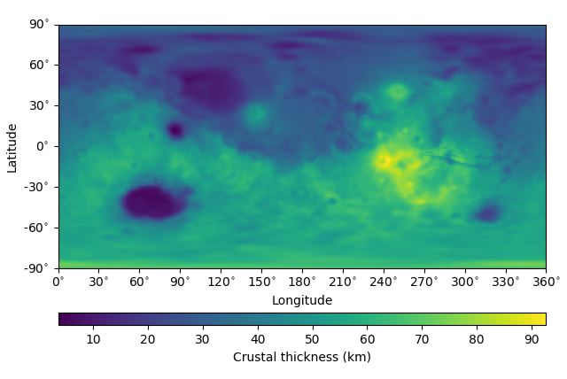

.. toctree::
   :maxdepth: 2
   :hidden:
   :caption: Getting Started

   installation.rst
   examples.rst
   references.rst

.. toctree::
   :maxdepth: 2
   :hidden:
   :caption: User Guide

   source/pycrust.rst

pyCrust
=======

pyCrust provides several functions and example scripts for generating
crustal thickness maps of a planet from gravity and topography data.
